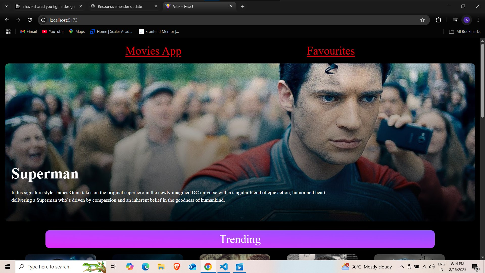
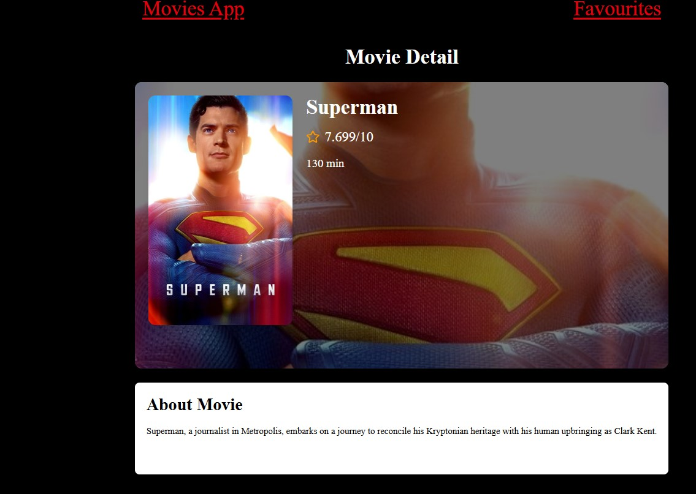
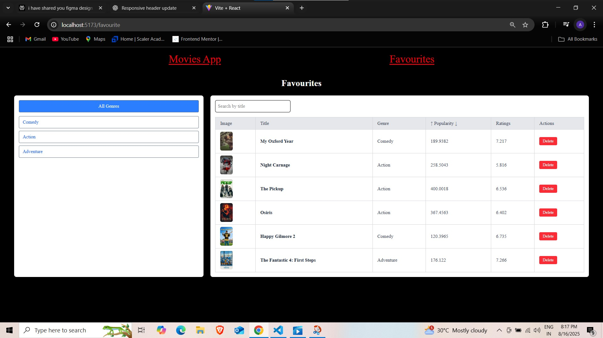

# 🎬 Movie App

A React + Redux powered Movie App that lets you explore now-playing movies, view detailed information, and manage your own list of favourite movies.  
It uses the **RapidAPI TV Show API** to fetch live data.  

---

## ✨ Features

- 🔍 Browse **Now Playing Movies** with pagination  
- 📄 View **Movie Details** (title, runtime, rating, description, etc.)  
- ⭐ Add movies to **Favourites** and manage them  
- 🎭 Filter favourites by **Genre**  
- 🔎 **Search** within favourites  
- ↕️ Sort favourites by **Popularity** and **Ratings**  
- 🗑️ Remove movies from favourites  
- 📱 Fully **Responsive UI** with TailwindCSS  

---

## 🛠️ Tech Stack

- **Frontend:** React (Vite), Redux Toolkit, React Router, TailwindCSS  
- **Icons:** React Icons  
- **API:** [RapidAPI TV Show API](https://rapidapi.com)  

---

## 📂 Project Structure

src/
├── components/ # UI Components (MovieList, MovieCard, Detail, Hero, Pagination, etc.)
├── pages/ # Pages (MovieDetail, Favourites, etc.)
├── store/ # Redux slices & store configuration
├── context/ # Context for favourites (if needed)
└── App.jsx # Main App entry

## 📸 Screenshots  

### Home Page  
  

### Movie Detail Page  
  

### Favourites Page  
  
